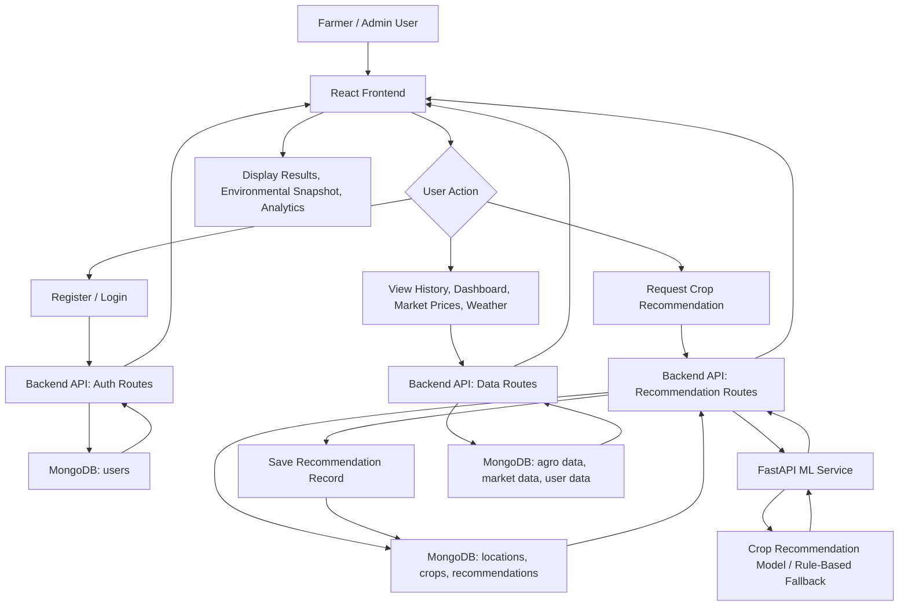
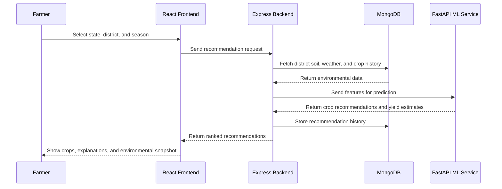
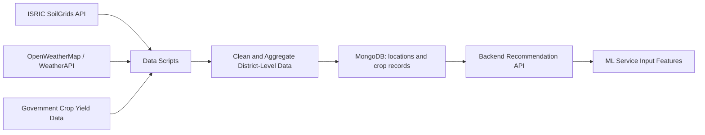

# Agri-Advisor Workflow Diagram

## System Workflow

## Recommendation Flow

## Data Preparation Flow

## Main Components

| Layer | Technology | Responsibility |
| --- | --- | --- |
| Frontend | React | User interface, auth screens, recommendation forms, dashboards |
| Backend | Node.js / Express | API routes, authentication, MongoDB access, ML service coordination |
| Database | MongoDB | Users, crops, locations, recommendations, historical data |
| ML Service | FastAPI / Python | Crop recommendation and yield prediction logic |
| Data Scripts | Python | Soil, weather, and crop data acquisition and aggregation |
